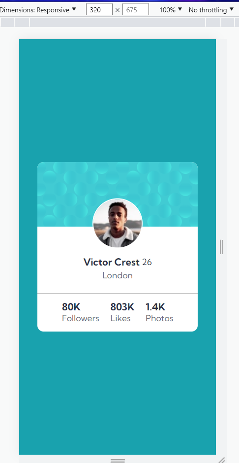
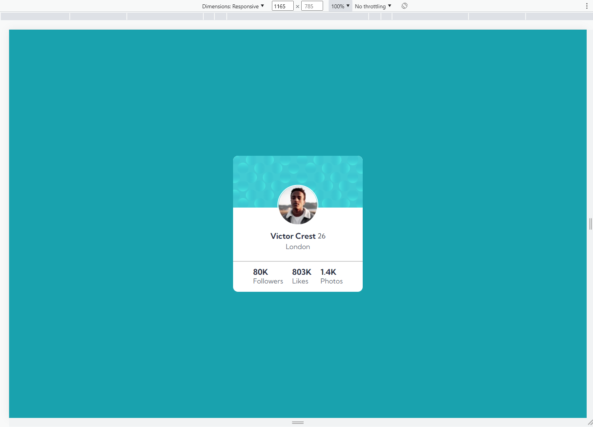

# Frontend Mentor - Profile card component solution

This is a solution to the [Profile card component challenge on Frontend Mentor](https://www.frontendmentor.io/challenges/profile-card-component-cfArpWshJ). Frontend Mentor challenges help you improve your coding skills by building realistic projects. 

## Table of contents

- [Overview](#overview)
  - [The challenge](#the-challenge)
  - [Screenshot](#screenshot)
  <!-- - [Links](#links) -->
- [My process](#my-process)
  - [Built with](#built-with)
  - [What I learned](#what-i-learned)
  
 
- [Author](#author)
- [Acknowledgments](#acknowledgments)

## Overview

### The challenge

- Build out the project to the designs provided.

### Screenshot

[]

[]

<!-- ### Links -->

<!-- - Solution URL: [Add solution URL here](https://your-solution-url.com) -->

## My process

### Built with

- Semantic HTML5 markup
- CSS custom properties
- Flexbox

### What I learned

At this point I'm just a newbie... This is bacically my first attempt. I'd really appreciate any help. The profile card component challenge is not completed yet, as there are some areas to adjust.

## Author

- Frontend Mentor - [@keeTeles](https://www.frontendmentor.io/profile/KeeTeles)

## Acknowledgments

It was a big help to see the class from the course Dev Quest!

